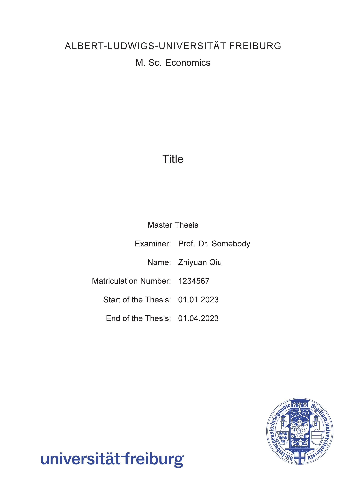
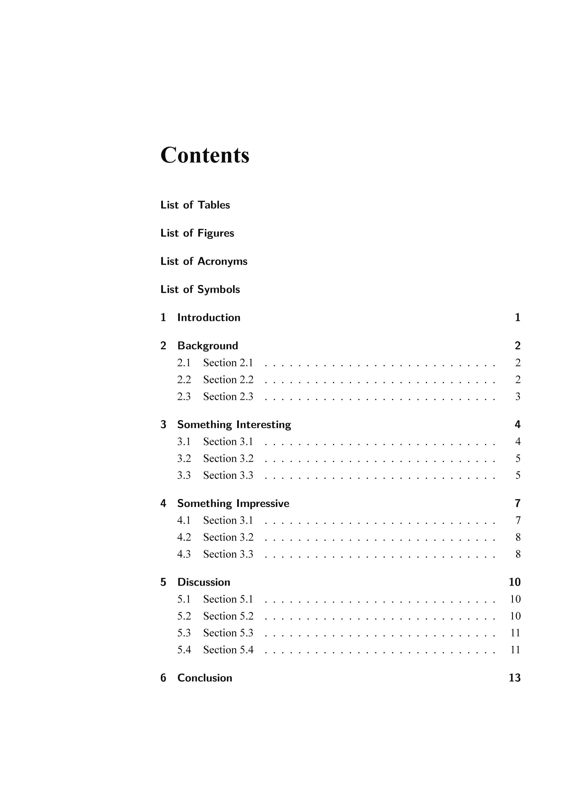
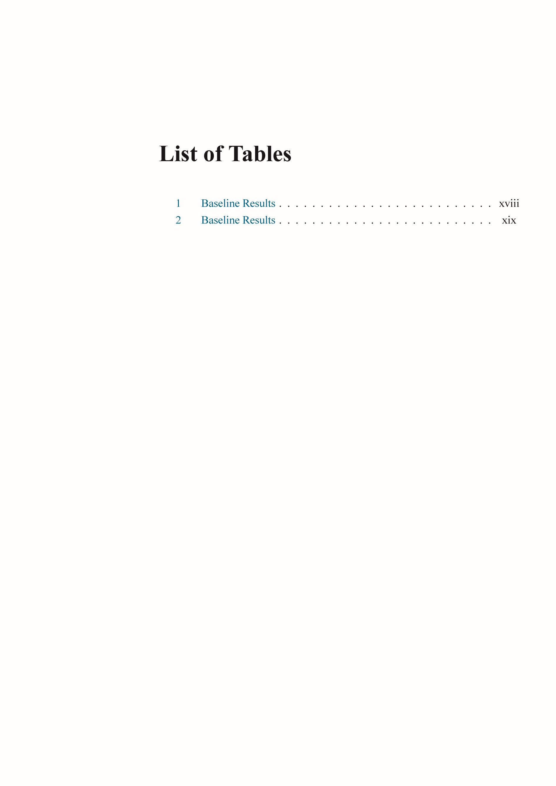
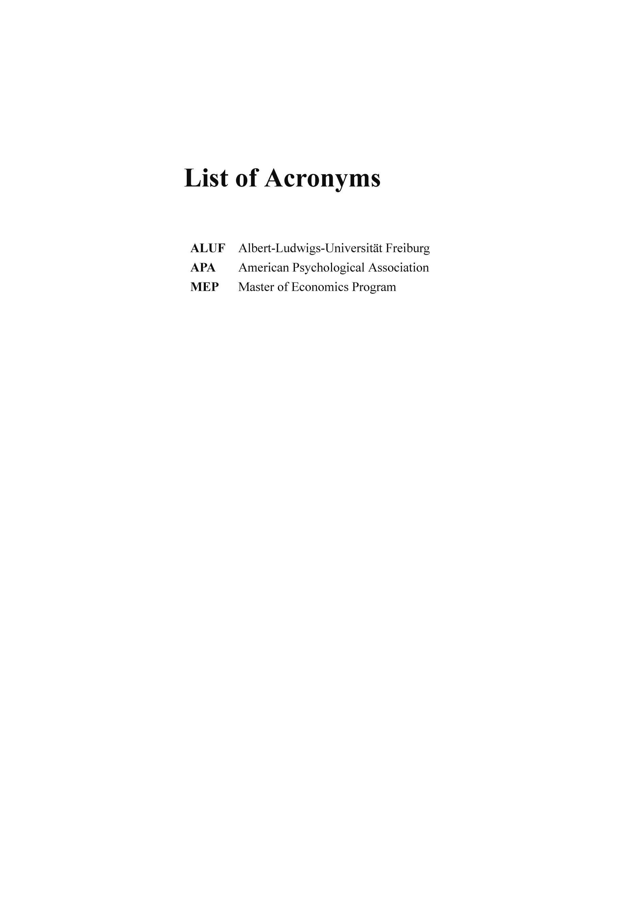
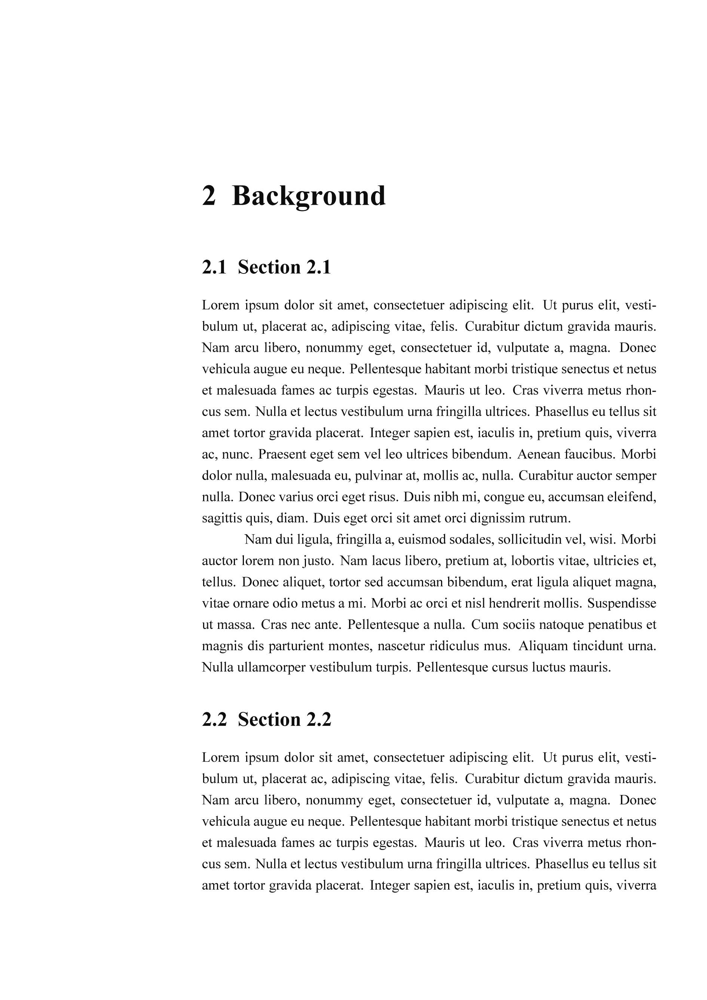
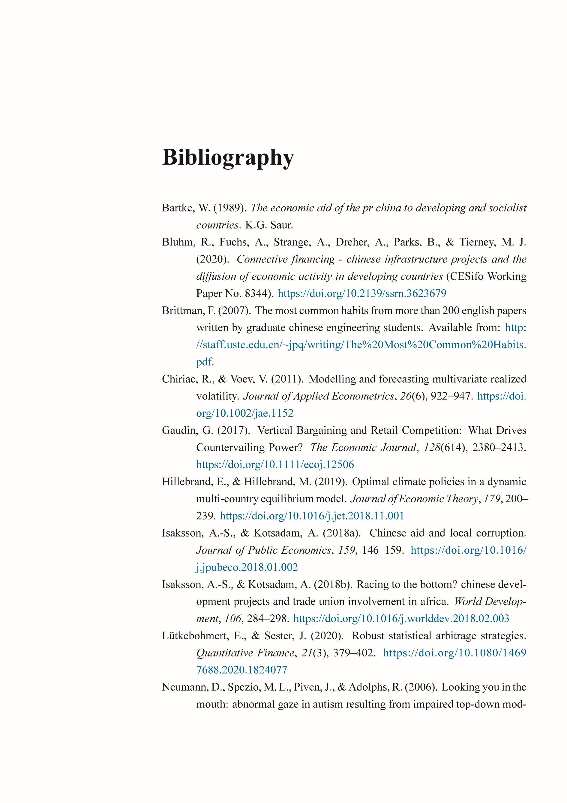

# MEP Thesis LaTeX Template
at the University of Freiburg

**English** · [简体中文](./README.zh-CN.md) · [Documentation](./Template_Documentation.pdf)

## Introduction
This is a primary *unofficial* template for the Master's thesis in the [M. Sc. Economics Program](https://master.econ.uni-freiburg.de/) at the University of Freiburg.  
I built this template for personal use during writing my own thesis and I thought it might be helpful to share it with other students in the program.  
The layout and design are based on the guidelines and regulations of the [program's official website](https://master.econ.uni-freiburg.de/students/procedures), particularly [this document](https://master.econ.uni-freiburg.de/data/master-thesis-guidelines-20191127.pdf).  
This is certainly a far-from-perfect template since I am a newbie at LaTeX too.  Suggestions for amendments are welcome.  

### Features
- Contains the necessary thesis components from the title page to certification, whose order follows academic writing conventions
- Cross-platform support with the latest MiKTeX and TeX Live distributions.
- Uses the [APA](https://apastyle.apa.org/) bibliography style prevailing in economics lieterature. The latest version (7th) is used by default

### Preview
| Title Page                                 | Contents                                     |
| ------------------------------------------ | -------------------------------------------- |
|   |        |
| List of Tables                             | List of Acronyms                             |
|  |  |
| Chapters                                   |                                              |
|     |       |
| Bibliography                               | Certification                                |
|           |   |

## Usage
1. **Download source files**: click [here](https://github.com/Contralitary/ALUF-MEP-Thesis/archive/refs/heads/main.zip) or go to **Code** > **Download ZIP** above the list of files
2. Install a LaTeX distribution and an editor.  
	- **LaTeX distribution**: [MiKTeX](https://miktex.org/download) or [TeX Live](https://tug.org/texlive/)
	- **Editor**: [TeXstudio](https://www.texstudio.org/) or [Kile](https://kile.sourceforge.io/download.php)
3. Open `main.tex` in the source files with your editor and set it as the root document for compilation.
	- **TeXstudio**: **Options** menu > **Root Document** > **Set Current Document As Explicit Root**
	- **Kile**: **Settings** menu > **Define Current Document as 'Master Document'**
4. Open the documents in the `2_Contents` folder and start writing. [`Template_Documentation.pdf`](./Template_Documentation.pdf) introduces in detail the structure and settings of the template, as well as the necessary LaTeX commands to get started
5. To compile a PDF document, you can also use the `make.bat` if you are using MiKTeX on MS Windows. I don't use Linux so there is no `makefile`.

## Disclaimer
- As unofficial as this template is, it was created with strict reference to the guidelines and other official documents on the program's official website, as described in the [Introduction](#Introduction). The fonts, their sizes and positions are kept as identical as possible to the official templates (if provided).
- Nevertheless, *any format review issues and grading issues arising from the use of this template are not the responsibility of the author of this template*. This template is merely aimed to facilitate the use of a professional and efficient writing tool for academic writing, focusing on the quality of typography, ease of use, and compliance with the program's guidelines.
- The components in this template should be complete, but the user should add, modify or delete them according to the actual needs.
- Suggestions for amendments are welcome

## License
[LPPL-1.3c license](./LICENSE).
