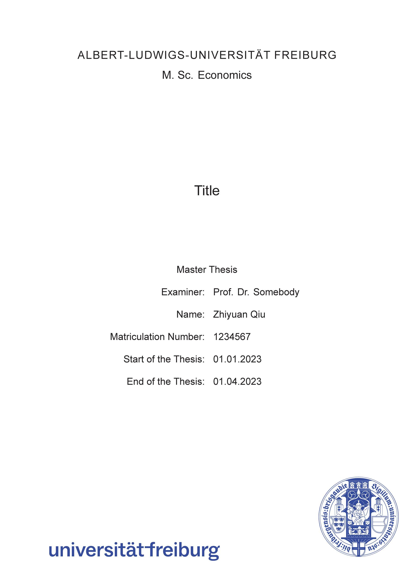
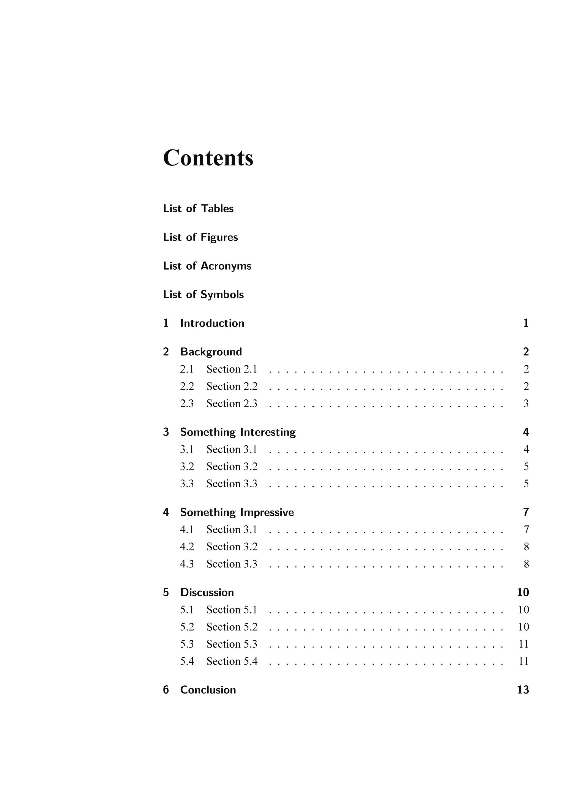
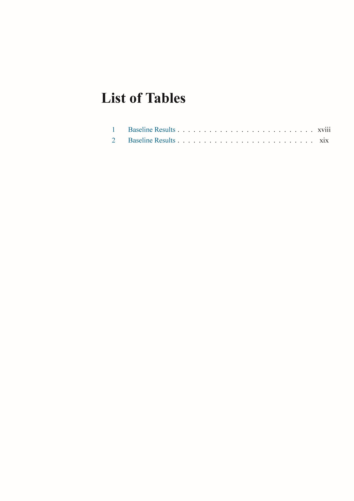
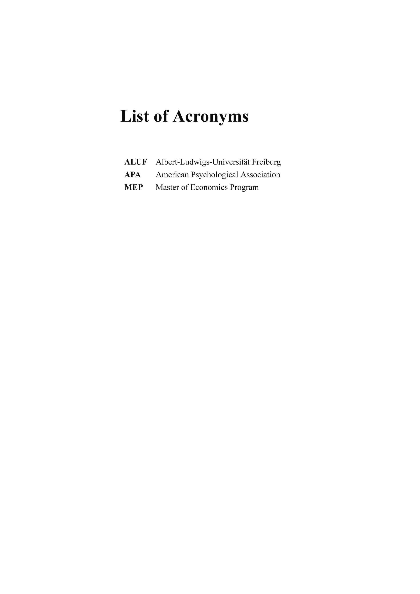
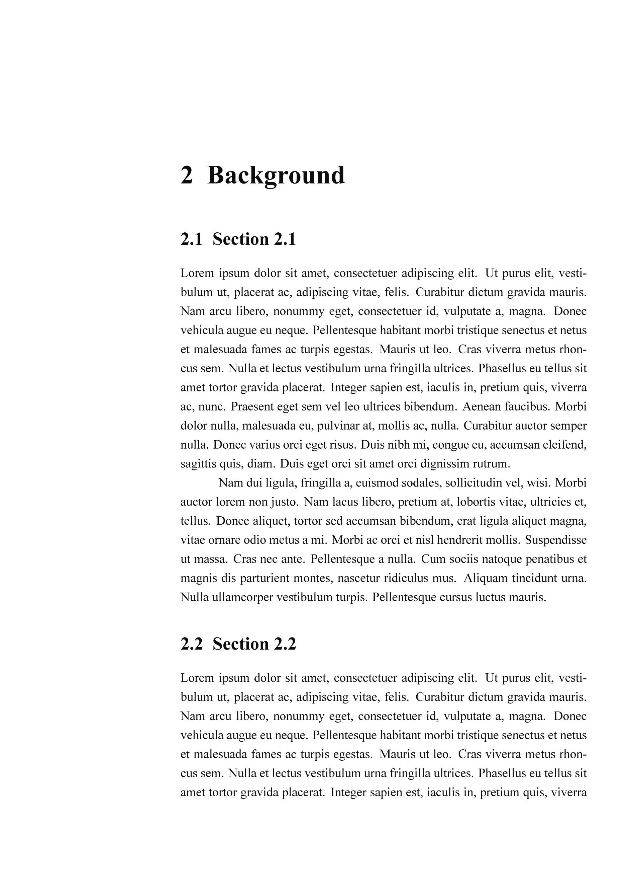
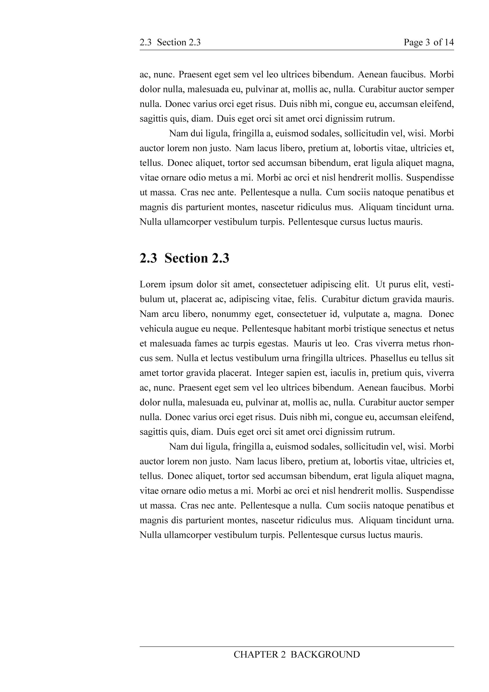
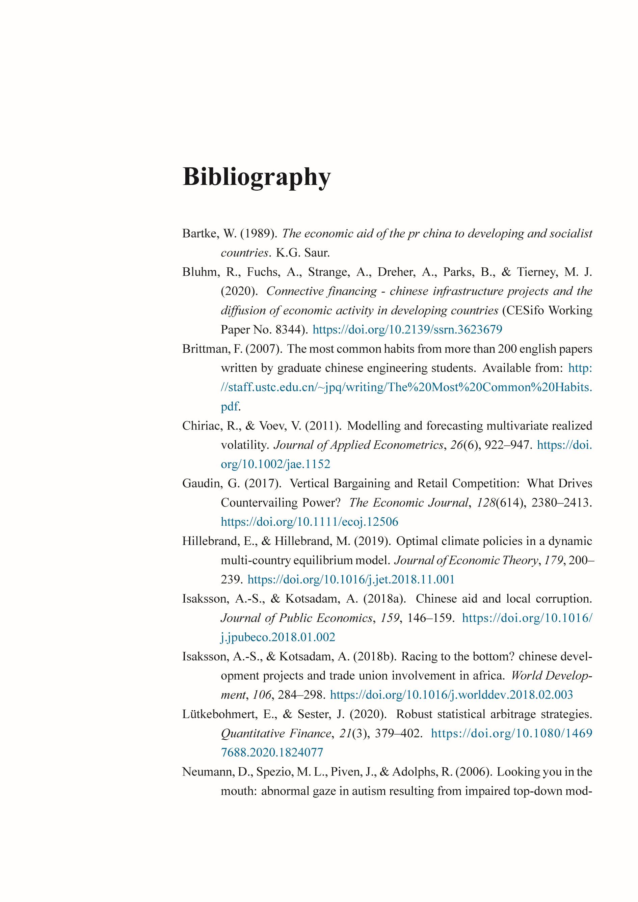
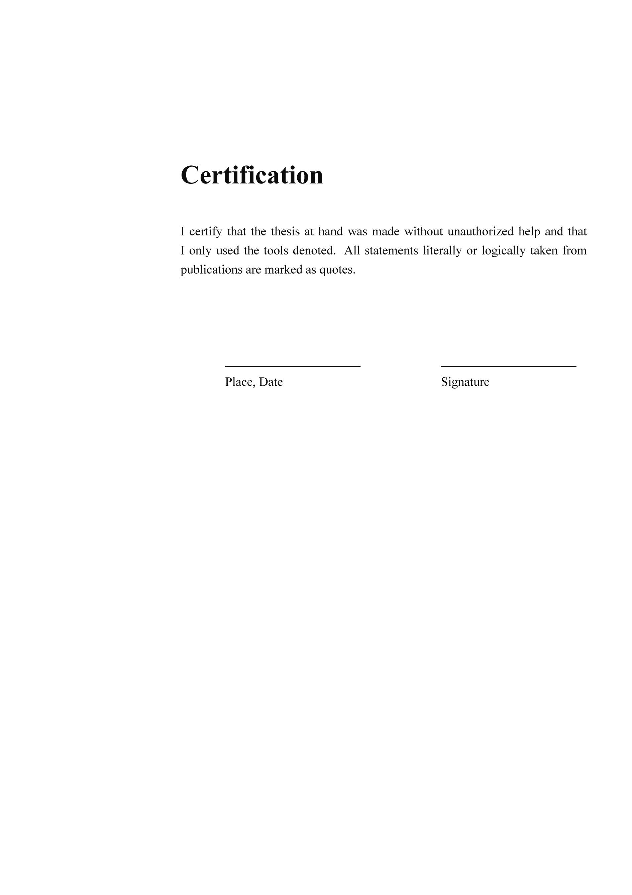

# 弗赖堡大学经济学硕士毕业论文LaTeX模板

[English](./README.md) · **简体中文** · [Documentation](./Template_Documentation.pdf)

## 简介
这是[弗赖堡大学经济学硕士项目（MEP）](https://master.econ.uni-freiburg.de/)毕业论文的**非官方**初步 LaTeX 模板。  
我在撰写自己的毕业论文时建立了这个模板供个人使用，我认为把这个模板分享出来可能会对其他同学有所帮助。  
其布局和设计基于该[项目官方网站](https://master.econ.uni-freiburg.de/students/procedures)的 guidelines 和规定，尤其是[此文档](https://master.econ.uni-freiburg.de/data/master-thesis-guidelines-20191127.pdf)。  
由于我自己也只是刚入门 LaTeX，这个模板难免会有不完善之处。 欢迎各位 LaTeX 牛人在这里对我的模板提出修改意见，有任何问题也可以致信我的[电子邮箱](mailto:zhiyuan.qiu@outlook.com)。  

### 主要特性
- 包含从 Title Page 一直到 Certification 的必要论文组件，组件顺序遵循学术写作惯例  
- 跨平台支持，兼容最新 MiKTeX 和 TeX Live 发行版。  
- 使用经济学文献中主流的 [APA](https://apastyle.apa.org/) 参考文献格式。 默认使用最新版本（当前第7版）的 APA  

### 预览

| 封面                                         | 目录                                           |
| ------------------------------------------ | -------------------------------------------- |
|   |        |
| 表格清单页                                      | 缩略语清单页                                       |
|  |  |
| 章节                                         |                                              |
|     |       |
| 参考文献                                       | Certification                                |
|           |   |

## 使用方法
1. **下载源文件**：点击[此处](https://github.com/Contralitary/ALUF-MEP-Thesis/archive/refs/heads/main.zip)或点击文件列表上方的**Code** > **Download ZIP**
2. 安装 LaTeX 发行套件和编辑器。  
	 - **LaTeX 发行套件**：[MiKTeX](https://miktex.org/download) 或 [TeX Live](https://tug.org/texlive/)
	 - **编辑器**：[TeXstudio](https://www.texstudio.org/) 或 [Kile](https://kile.sourceforge.io/download.php)
3. 用编辑器打开源文件中的`main.tex`，并将其设置为用于编译的根/主文件。
	 - **TeXstudio**：**选项**菜单 > **主文档** > **将当前文档设置为主文档**
	 - **Kile**：**设置**菜单 > **将当前文档设为“主文档”**
4. 打开`2_Contents`文件夹中的章节文档，开始写作。 [`Template_Documentation.pdf`](./Template_Documentation.pdf)详细介绍了模板的结构设计和各项设定配置，以及入门所需的 LaTeX 命令
5. 如果电脑操作系统为 MS Windows，还可以使用 `make.bat`一键编译PDF。 我不使用 Linux 系统，所以没有编写 `makefile`。

## 免责声明
- 本模板虽为非官方模板，但在制作过程中严格参考了[简介](#简介)中所述的 guidelines 和项目官方网站上的其他官方文档。模板中的字体样式、大小和位置都尽可能与官方模板（如Title Page）保持一致。
- 尽管如此，*使用本模板所产生的任何格式审查问题和评分问题均与本模板作者无关，作者概不负责*。本模板旨在方便大家使用专业、高效的学术写作工具，重点关注排版质量、专业性、易用性，以及是否符合项目 guidelines。
- 本模板中的各组件组成应当已完备，但用户仍应根据实际需要进行添加、修改或删除。
- 欢迎提出修改建议

## 开源许可证
[LPPL-1.3c license](./LICENSE).
